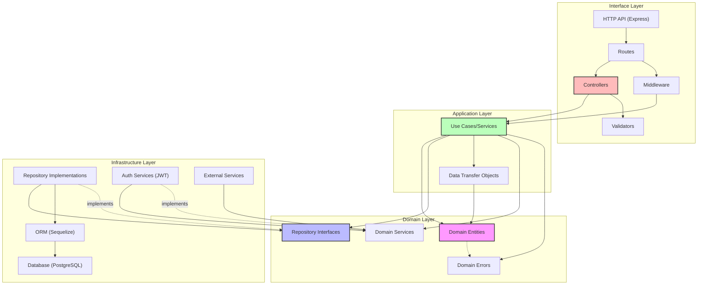

# Component Diagram

This document shows the high-level component structure of the PhysiPro API, illustrating how the different layers interact according to the clean architecture principles.

## High-Level Architecture

## Clean Architecture Layers

The component diagram above illustrates how the PhysiPro API is structured according to clean architecture principles:

1. **Interface Layer (Adapters)**: This layer handles HTTP requests and responses, routing, and input validation.
   - Controllers, routes, and middleware interact with the application layer.
   - No direct dependencies on the infrastructure layer.

2. **Application Layer (Use Cases)**: Contains application-specific business rules and orchestrates the flow of data.
   - Services implement use cases by coordinating domain entities and services.
   - Depends only on the domain layer.

3. **Domain Layer (Entities)**: Contains business entities and core business rules.
   - No dependencies on other layers - this is the most stable layer.
   - Defines interfaces for repositories and services.
   - Contains domain-specific errors and validation rules.

4. **Infrastructure Layer (Frameworks)**: Implements interfaces defined in the domain layer.
   - Repository implementations, database access, authentication mechanisms.
   - Adapts external libraries and frameworks to the application.

## Key Components

1. **Controllers**: Handle HTTP requests, delegate to services, and format responses.
2. **Services**: Implement use cases, coordinate entities and repositories.
3. **Repositories**: Access and manipulate data storage.
4. **Entities**: Core business objects with their validation rules.
5. **Middleware**: Handle cross-cutting concerns like authentication and error handling.

## Dependency Flow

The arrows in the diagram represent dependencies, which primarily flow inward (toward the domain layer). This ensures that:

- The domain layer is independent and can be tested in isolation.
- The application layer depends only on the domain layer.
- The interface and infrastructure layers depend on the application and domain layers.
- Lower layers never depend on higher layers.

This design promotes:
- Testability
- Maintainability
- Flexibility to change external tools and frameworks 
