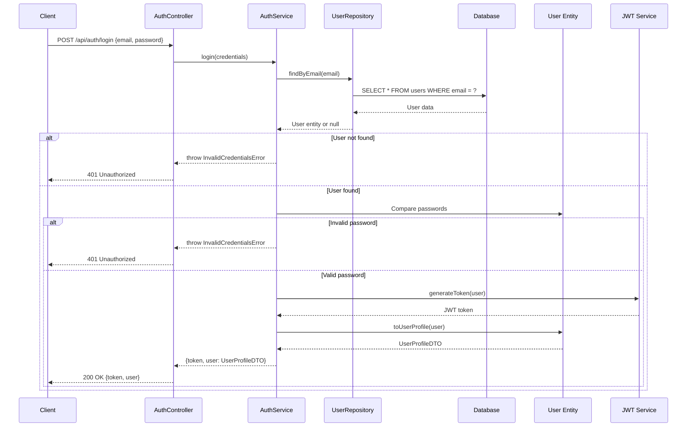
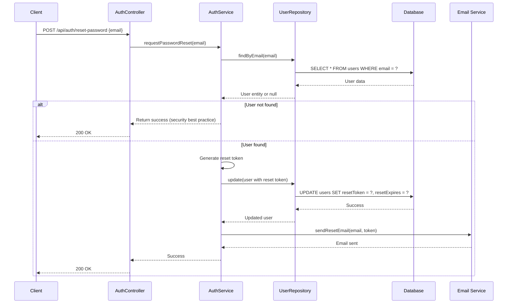
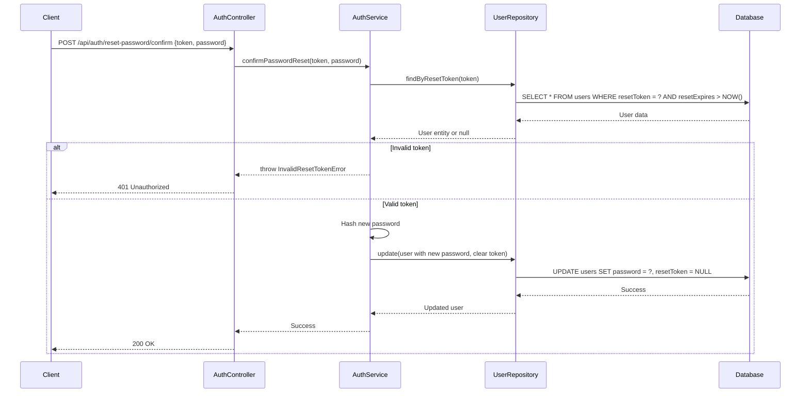
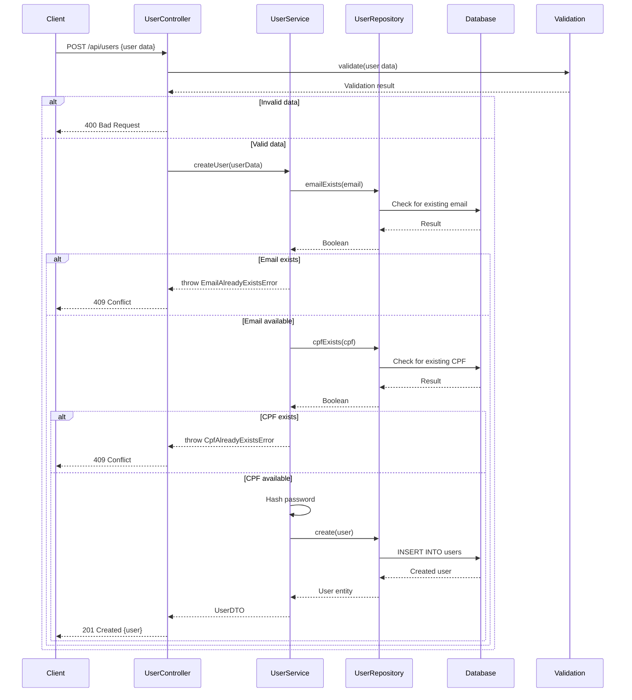
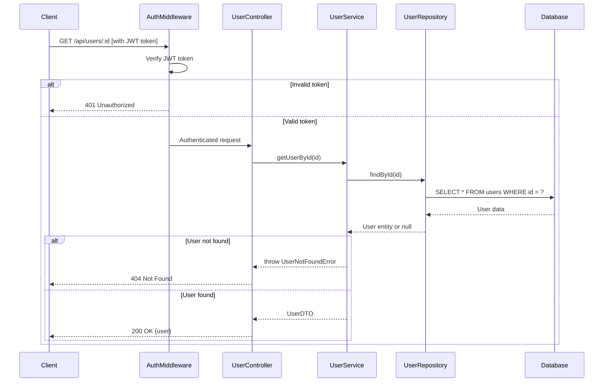
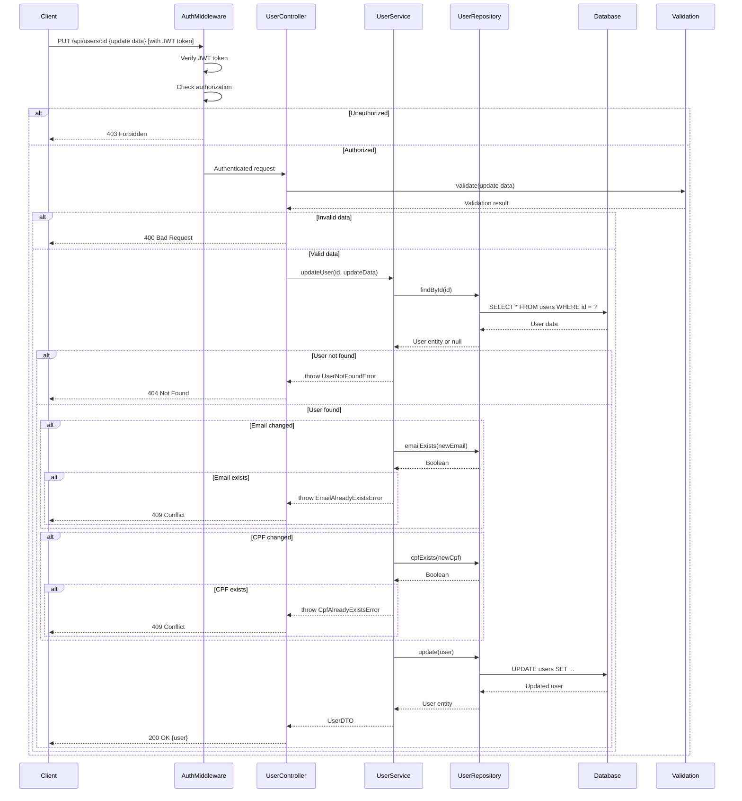
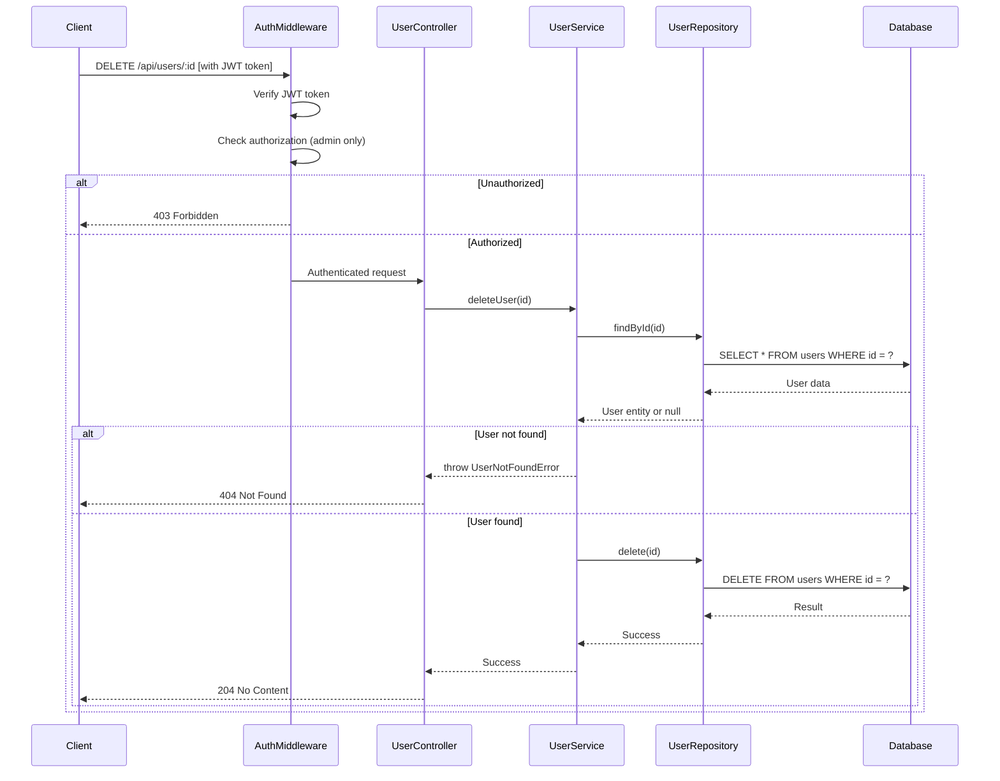
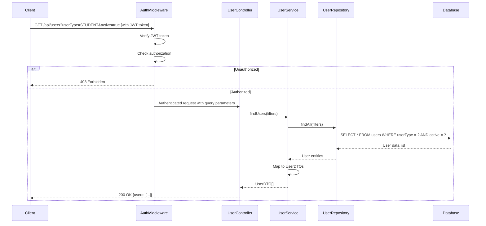
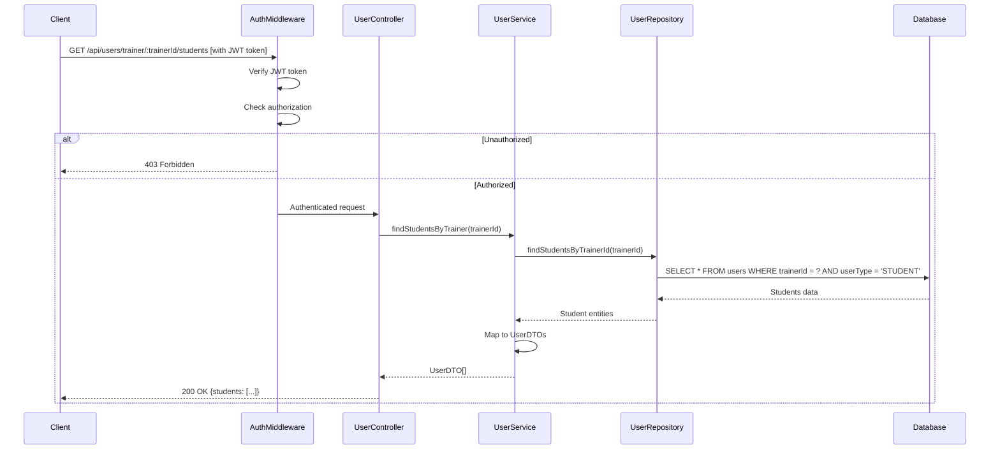

# Sequence Diagrams

This document contains sequence diagrams that illustrate the key flows in the PhysiPro API.

## Authentication Flows

### User Login

This sequence diagram shows the flow of a user logging into the system:

### Password Reset Request

### Password Reset Confirmation

## User Management Flows

### User Registration

### Get User Profile

### Update User

### Delete User

## Search and Filtering Flows

### List Users with Filtering

### Find Students by Trainer

